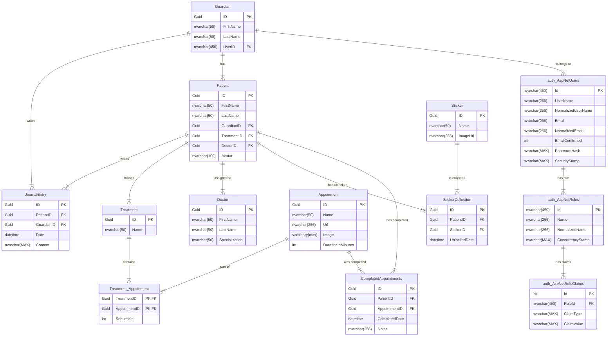

# Entity Relationship Diagram

```mermaid
erDiagram
    Doctor {
        Guid ID PK
        nvarchar(50) FirstName
        nvarchar(50) LastName
        nvarchar(50) Specialization
    }
    
    Guardian {
        Guid ID PK
        nvarchar(50) FirstName
        nvarchar(50) LastName
        nvarchar(450) UserID FK
    }

    Patient {
        Guid ID PK
        nvarchar(50) FirstName
        nvarchar(50) LastName
        Guid GuardianID FK
        Guid TreatmentID FK
        Guid DoctorID FK
        nvarchar(100) Avatar
    }

    JournalEntry {
        Guid ID PK
        Guid PatientID FK
        Guid GuardianID FK
        datetime Date
        nvarchar(MAX) Content
    }

    Treatment {
        Guid ID PK
        nvarchar(50) Name
    }

    Appoinment {
        Guid ID PK
        nvarchar(50) Name
        nvarchar(256) Url
        varbinary(max) Image
        int DurationInMinutes
    }

    Treatment_Appoinment {
        Guid TreatmentID PK, FK
        Guid AppoinmentID PK, FK
        int Sequence
    }

    auth_AspNetUsers {
        nvarchar(450) Id PK
        nvarchar(256) UserName
        nvarchar(256) NormalizedUserName
        nvarchar(256) Email
        nvarchar(256) NormalizedEmail
        bit EmailConfirmed
        nvarchar(MAX) PasswordHash
        nvarchar(MAX) SecurityStamp
    }

    auth_AspNetRoles {
        nvarchar(450) Id PK
        nvarchar(256) Name
        nvarchar(256) NormalizedName
        nvarchar(MAX) ConcurrencyStamp
    }

    auth_AspNetRoleClaims {
        int Id PK
        nvarchar(450) RoleId FK
        nvarchar(MAX) ClaimType
        nvarchar(MAX) ClaimValue
    }

    Sticker {
        Guid ID PK
        nvarchar(50) Name
        nvarchar(256) ImageUrl
    }

    StickerCollection {
        Guid ID PK
        Guid PatientID FK
        Guid StickerID FK
        datetime UnlockedDate
    }
        CompletedAppointments {
        Guid ID PK
        Guid PatientID FK
        Guid AppointmentID FK
        datetime CompletedDate
        nvarchar(256) Notes
    }

    Patient ||--|{ CompletedAppointments : "has completed"
    Appoinment ||--|{ CompletedAppointments : "was completed"
    Patient ||--|{ StickerCollection : "has unlocked"
    Sticker ||--|{ StickerCollection : "is collected"
    Guardian ||--|{ auth_AspNetUsers : "belongs to"
    Guardian ||--|{ Patient : "has"
    Patient ||--|{ Doctor : "assigned to"
    Patient ||--|{ Treatment : "follows"
    Patient ||--|{ JournalEntry : "writes"
    Guardian ||--|{ JournalEntry : "writes"
    Treatment ||--|{ Treatment_Appoinment : "contains"
    Appoinment ||--|{ Treatment_Appoinment : "part of"
    auth_AspNetUsers ||--|{ auth_AspNetRoles : "has role"
    auth_AspNetRoles ||--|{ auth_AspNetRoleClaims : "has claims"
```
